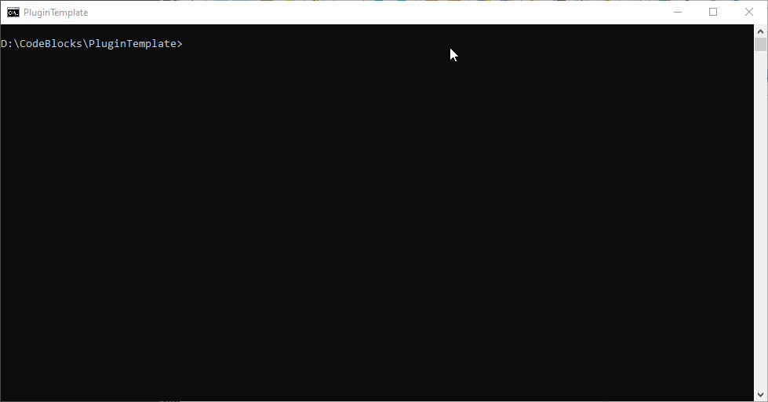

# Advanced-pattern-search

plugin for x64dbg
**Under development**

## Description

Advanced Search for patterns inddd proccess memory

## Usage

## Installing

## Building

From a Visual Studio command prompt:

```
mkdir build && cd build
cmake ..
```

You will get `PluginTemplate.sln` that you can open in Visual Studio.

Alternatively you can open this folder in Visual Studio/CLion/Qt Creator.



